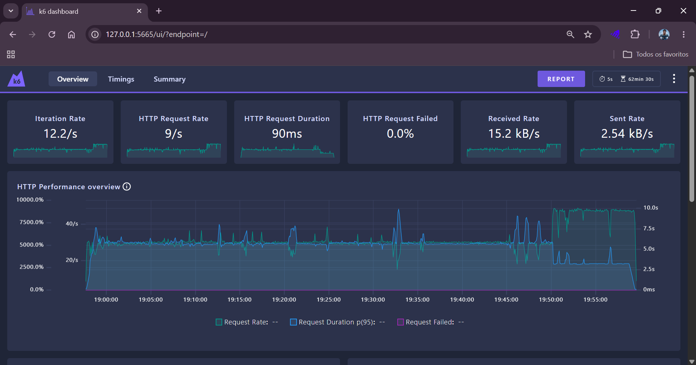
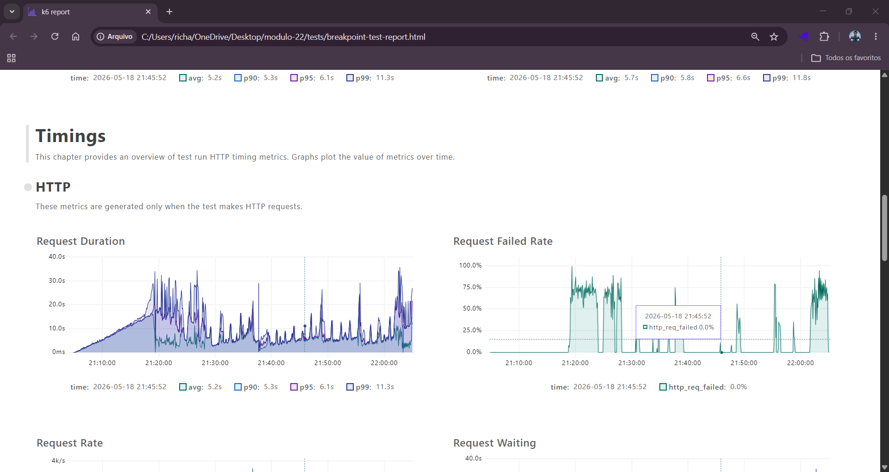

# Módulo 22 - Testes de Performance com k6

Este repositório contém os exercícios e evidências do Módulo 22, com foco em testes de performance utilizando o k6.

## Objetivo

O objetivo do projeto é praticar a criação e execução de testes de performance com k6, incluindo:

- Configuração inicial do projeto
- Criação de métricas
- Uso de asserts e limites
- Testes com token dinâmico
- Geração de relatórios
- Execução de testes de carga, soak, spike e breakpoint

## Tecnologias utilizadas

- JavaScript
- k6
- Node.js
- Git
- GitHub

## Estrutura do projeto

```bash
modulo-22-k6-performance-tests/
│
├── passo-1-setup/
├── passo-2-metricas/
├── passo-3-asserts-limits/
├── passo-4-token/
├── passo-5-report/
├── tests/
├── config.js
├── geraToken.js
└── README.md
```

## Descrição das pastas

### passo-1-setup

Contém a configuração inicial dos testes com k6.

### passo-2-metricas

Contém testes com uso de métricas para análise de performance.

### passo-3-asserts-limits

Contém testes com validações, checks, thresholds e limites.

### passo-4-token

Contém testes utilizando token dinâmico para autenticação.

### passo-5-report

Contém a configuração para geração de relatório dos testes executados.

### tests

Contém os testes de performance organizados por tipo de execução.

## Tipos de testes realizados

### Load Test

Teste utilizado para verificar o comportamento da aplicação com uma carga esperada de usuários.

### Soak Test

Teste utilizado para avaliar a estabilidade da aplicação durante um período mais longo de execução.

### Spike Test

Teste utilizado para verificar como a aplicação reage a um aumento repentino de usuários.

### Breakpoint Test

Teste utilizado para identificar o limite máximo suportado pela aplicação antes de apresentar falhas ou degradação significativa.

## Como executar os testes

Para executar um teste com k6, utilize o comando:

```bash
k6 run nome-do-arquivo.js
```

Exemplo:

```bash
k6 run tests/load-test.js
```

Também é possível executar outros testes da pasta `tests`:

```bash
k6 run tests/soak-test.js
```

```bash
k6 run tests/breakpoint-test.js
```

```bash
k6 run tests/spike-test.js
```

## Relatórios

Os relatórios e evidências dos testes foram gerados a partir da execução dos scripts com k6.

As evidências podem incluir:

- Resultado no terminal
- Relatório HTML
- Prints da execução
- Arquivos de saída gerados pelo k6

## Evidências dos testes

### Soak Test

A imagem abaixo apresenta o relatório do Soak Test, utilizado para avaliar a estabilidade da aplicação durante um período mais longo de execução.



### Breakpoint Test

A imagem abaixo apresenta o relatório do Breakpoint Test, utilizado para identificar o limite da aplicação conforme a carga de usuários aumenta progressivamente.

É possível observar variações no tempo de resposta, aumento da taxa de requisições e momentos de falha conforme a aplicação se aproxima do seu limite.



## Autor

Richard Marlon Balestrim

## Curso

EBAC - Engenheiro de Qualidade de Software

## Módulo

Módulo 22 - Testes de Performance com k6
